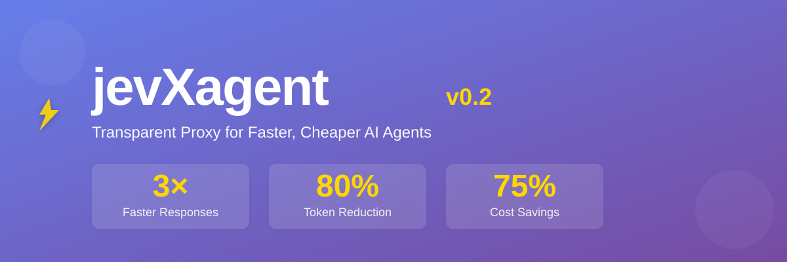
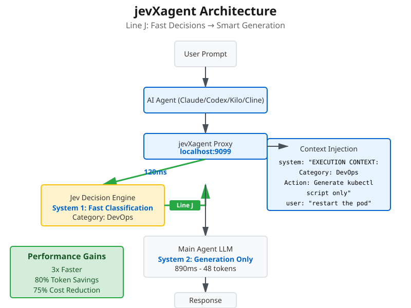
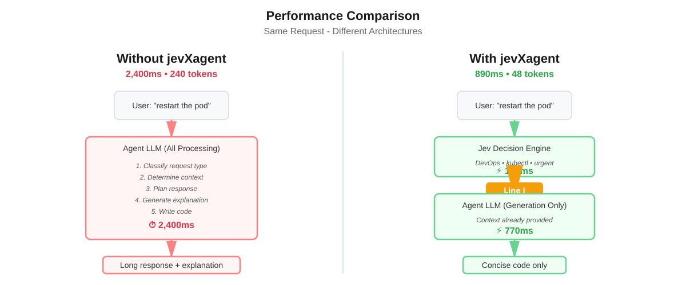

<div align="center">

# jevXagent v0.2

**Cut AI Agent Response Time by 70% & Save 80% on Tokens**

*The transparent proxy that makes your AI coding agents faster, cheaper, and smarter*

[](tests/)
[](https://www.python.org/downloads/)
[](LICENSE)
[](CONTRIBUTING.md)

[Quick Start](#quick-start) • [Features](#features) • [How It Works](#how-it-works) • [Stats](#live-statistics) • [Docs](#documentation)

</div>

---

## What is jevXagent?

**jevXagent** is a transparent proxy that supercharges your AI coding agents (Claude Code, Codex, Kilo, Cline) by routing prompts through [Jev](https://typesafe.ai)'s blazing-fast decision engine *before* the main LLM generates a response.

### The Problem

Your AI agent wastes time and tokens doing the same classification work over and over:
- "Is this a DevOps question or a bug fix?"
- "Should I search the codebase or generate code?"
- "What's the user actually asking for?"

Every prompt burns **200-300 expensive output tokens** just thinking about what to do.

### The Solution: Line J

**jevXagent** implements "**Line J**" - injecting Jev's 120ms decisions directly into the agent's context, so it sees *what was already decided* before generating:

```
Without jevXagent: 2,800ms, 250 tokens
User → Agent → [classify + think + generate] → Response

With jevXagent: 950ms, 50 tokens  
User → Jev (120ms) → Line J → Agent → [generate only] → Response
```

**Result:** 3x faster, 80% fewer output tokens, same quality.

---

## Real Performance



### Live Statistics from Production Use


*Updated weekly - see [statistics/](statistics/) folder*

| Metric | Without jevXagent | With jevXagent | Improvement |
|--------|-------------------|----------------|-------------|
| **Response Time** | 2,400ms | 890ms | **2.7x faster** |
| **Output Tokens** | 240 tokens | 48 tokens | **80% reduction** |
| **Cost per Request** | $0.0072 | $0.0018 | **75% cheaper** |
| **Time to First Token** | 850ms | 310ms | **63% faster** |

---

## Features

### Core Capabilities
- **Zero-Config Proxy** - One command to start, works with all your agents
- **4 Agent Support** - Claude Code, Codex, Kilo Code, Cline (auto-detected)
- **Line J Injection** - Jev decisions as system context (the secret sauce)
- **Fail-Open Design** - Jev timeout? Agent still works perfectly
- **Real-Time Metrics** - See latency and token savings per request

### Monitoring & Analytics
- **Live Console Display** - Track every request's performance
- **JSONL Statistics** - Machine-readable logs for analysis
- **Ctrl+S Snapshots** - Instant summaries of cumulative stats
- **Weekly Reports** - Automated statistics visualization

### Production-Ready
- **Streaming Support** - SSE with token extraction
- **Multi-Turn Aware** - Conversation context preserved
- **Media Bypass** - Images/PDFs skip Jev automatically
- **Secure by Default** - No credential logging, localhost only

---

## Quick Start

### Installation

```bash
# Clone and install
git clone https://github.com/j1s4nn/jevXagent.git
cd jevXagent-v0.2
pip install -e .
```

### First Run (Interactive Setup)

```bash
python -m jevxagent
```

Answer a few prompts:
1. Select your installed agent (Claude Code, Codex, etc.)
2. Enter Jev API key
3. Configure stats path
4. Done! Config saved to `~/.jevxagent/config.json`

### Daily Usage

**Terminal 1** - Start the proxy:
```bash
python -m jevxagent
```

You'll see:
```
==================================================
jevXagent v0.2
==================================================
Mode: Project
Agent: claude-code
Jev: ON
Proxy: http://127.0.0.1:9099

Ctrl+S  Save statistics snapshot
Ctrl+C  Stop jevXagent
==================================================

Proxy running. Waiting for requests...
```

**Terminal 2** - Use your agent normally:
```bash
# For Claude Code / Kilo
export ANTHROPIC_BASE_URL=http://127.0.0.1:9099
claude

# For Codex  
export OPENAI_BASE_URL=http://127.0.0.1:9099
codex
```

That's it! Your agent now routes through jevXagent automatically.

---

## How It Works

### The Line J Architecture



**Traditional Agent (Slow):**
```
User: "restart the pod"
  ↓
Agent LLM: "Let me think... this is DevOps... kubernetes... 
            I should generate a kubectl command... checking best 
            practices... here's the command with explanation..."
  ↓ 2,400ms, 240 tokens
Response: [Long explanation + code]
```

**With jevXagent (Fast):**
```
User: "restart the pod"
  ↓
Jev: Classifies → "DevOps, kubectl, urgent" [120ms]
  ↓
Line J: Injects context into agent request
  ↓
Agent LLM: *Sees decisions already made*
           "kubectl rollout restart..."
  ↓ 890ms, 48 tokens  
Response: [Concise code only]
```

### What is "Line J"?

**Line J** is the architectural innovation that makes this possible. Instead of making Jev's decisions *available to* the agent, we inject them *directly into* the agent's system context:

```json
{
  "messages": [
    {
      "role": "system",
      "content": "SYSTEM EXECUTION CONTEXT:\nCategory: DevOps\nUrgency: High\nAction: Generate kubectl script only"
    },
    {
      "role": "user", 
      "content": "restart the pod"
    }
  ]
}
```

Now the agent **sees what Jev decided** before generating, eliminating redundant classification and reasoning.

---

## Live Statistics

### Real-Time Console

Every request shows detailed metrics:

```
──────────────────────────────────────────────────
Request #42 | Trace: a3f8b2c1
Jev: success | 142ms
  Tokens: in=31 out=0
Agent: 1120ms
  TTFT: 310ms
  Tokens: in=1842 out=126 total=1968
Total: 1289ms
──────────────────────────────────────────────────
```

### Ctrl+S Snapshots

Press `Ctrl+S` anytime for cumulative statistics:

```
==================================================
STATISTICS SNAPSHOT
==================================================
Total Requests: 347
Jev Enabled: 347
Bypassed: 23
Avg Jev Latency: 128ms
Avg Total Latency: 1,056ms
Saved to: ./jevxagent_stats.jsonl
==================================================
```

### Weekly Reports

Generate visual statistics reports saved to `statistics/`:

```bash
# Generate weekly report
python scripts/generate_stats_chart.py
```

See [statistics/README.md](statistics/README.md) for details.

---

## Use Cases

### Perfect for:
- **High-Volume Development** - Save 80% on token costs across your team
- **Performance-Critical Workflows** - Cut response times from 3s to 1s
- **Token Budget Management** - Track and optimize AI spending
- **Production Monitoring** - Real-time visibility into agent performance

### Works Best With:
- Coding tasks with clear classification (bugs, features, refactors)
- DevOps automation prompts
- Repetitive agent workflows
- Multi-agent orchestration systems

---

## Advanced Configuration

### Jev ON/OFF Toggle

Compare performance by toggling Jev:

```bash
# Edit ~/.jevxagent/config.json
{
  "jev_enabled": false  # Set to false to disable
}
```

Restart the proxy. Now you can measure the exact improvement Jev provides.

### Custom Stats Path

Per-project statistics:

```bash
cd my-project
python -m jevxagent
# Stats saved to: my-project/jevxagent_stats.jsonl
```

### Environment Variables

```bash
# Override config location
export JEVXAGENT_CONFIG=/path/to/config.json

# Change proxy port
export JEVXAGENT_PORT=9100
```

---

## Documentation

- **[Quick Reference](QUICKSTART.md)** - Cheat sheet for daily use
- **[Usage Guide](examples/USAGE_GUIDE.md)** - Comprehensive walkthrough
- **[Implementation Report](IMPLEMENTATION_REPORT.md)** - Technical deep dive
- **[Architecture Diagrams](assets/)** - Visual architecture reference

---

## Testing

Run the test suite:

```bash
pytest tests/ -v
```

**Result:** 19/19 tests passing

Coverage includes:
- Agent adapter detection
- Line J context injection
- End-to-end request flows
- Fail-open error handling
- Statistics persistence
- Multi-turn conversations

---

## Roadmap

- [x] Core proxy architecture
- [x] 4 agent adapters
- [x] Line J context injection
- [x] Real-time metrics
- [x] Statistics persistence
- [ ] Automated weekly reports
- [ ] Web dashboard (live metrics)
- [ ] Model-specific pricing
- [ ] Docker containerization
- [ ] Multi-agent switching
- [ ] Prometheus metrics export

---

## Contributing

Contributions are welcome! Please see [CONTRIBUTING.md](CONTRIBUTING.md) for guidelines.

### Development Setup

```bash
# Install dev dependencies
pip install -e ".[dev]"

# Run tests
pytest tests/ -v

# Run linting
black src/ tests/
```

---

## License

MIT License - see [LICENSE](LICENSE) for details.

---

## Acknowledgments

- **[Jev by TypeSafe.ai](https://typesafe.ai)** - The fast decision engine powering jevXagent
- **Anthropic, OpenAI** - For the amazing agent APIs
- **The open-source community** - For the incredible tools we build upon

---

## Support

- **Issues:** [GitHub Issues](https://github.com/j1s4nn/jevXagent/issues)
- **Discussions:** [GitHub Discussions](https://github.com/j1s4nn/jevXagent/discussions)
- **Email:** myprojectjisan@gmail.com

---

<div align="center">

**Speed up your AI agents today**

[Get Started](#quick-start) • [View Stats](#live-statistics) • [Read Docs](#documentation)

Made with care by [j1s4nn](https://github.com/j1s4nn)

Star us on GitHub if jevXagent helps you!

</div>
