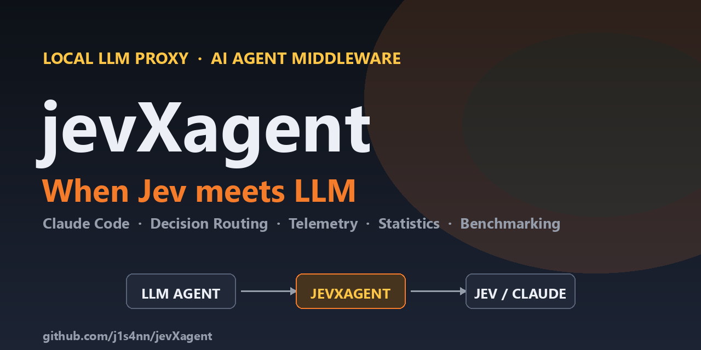
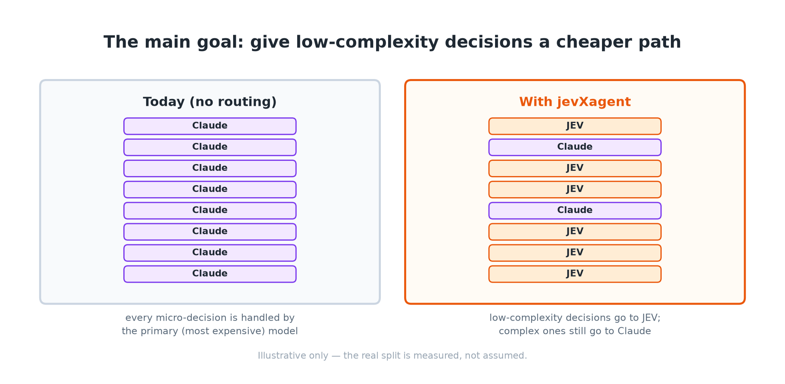
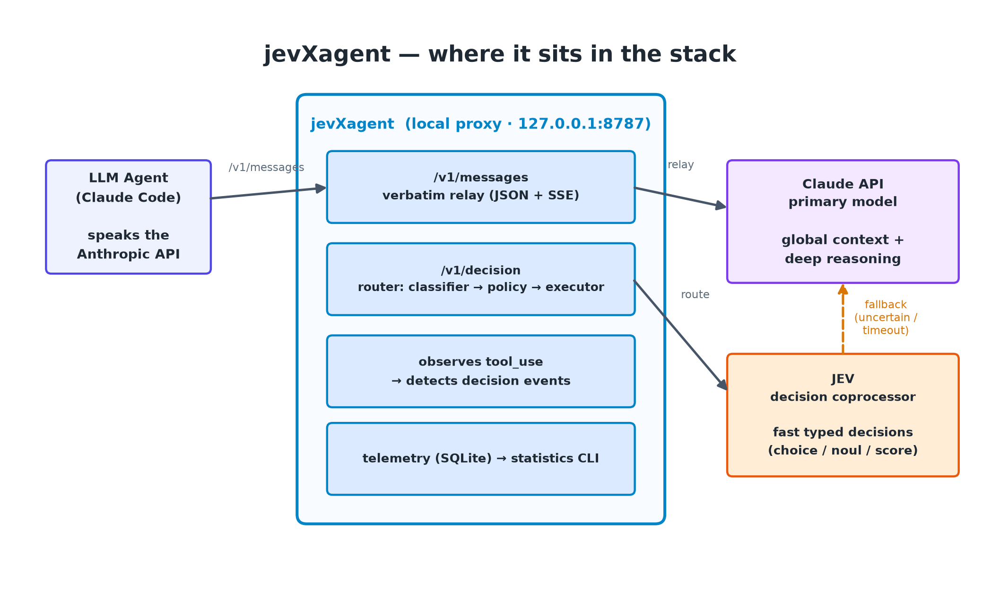
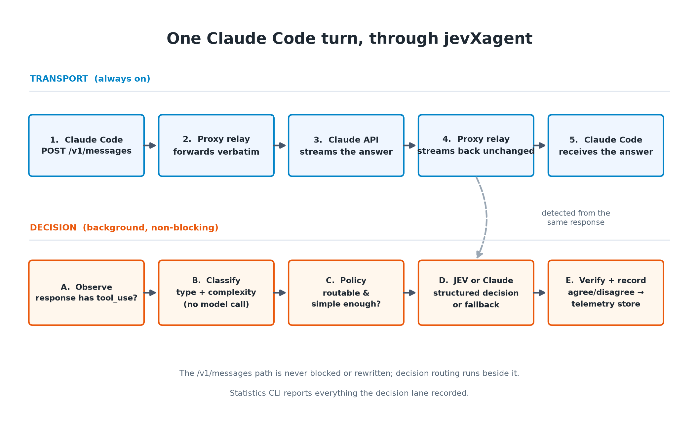
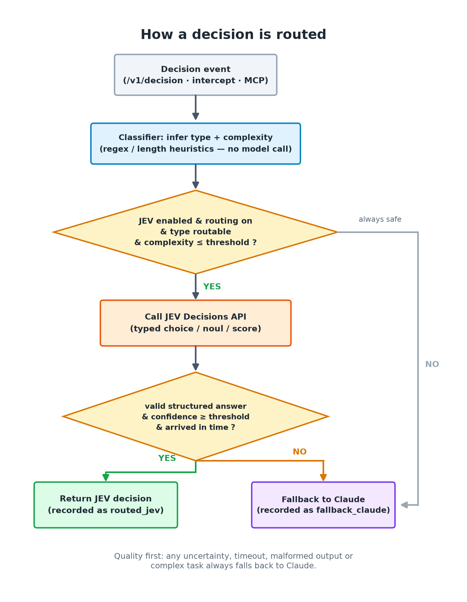
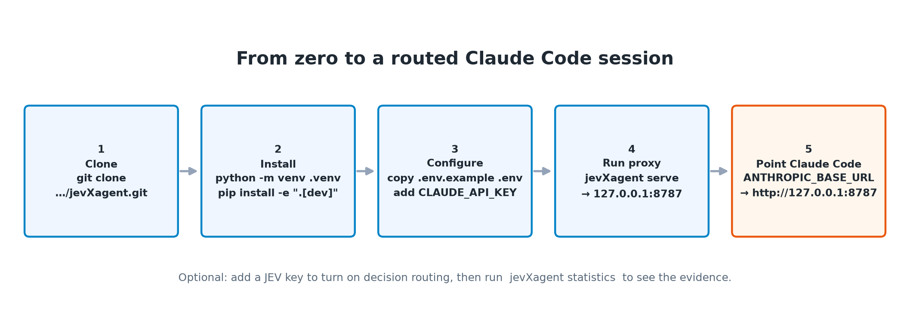
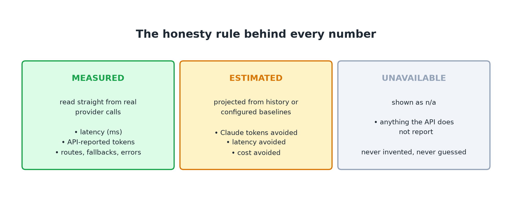

# jevXagent — When JEV Meets LLM Agent

**A local LLM proxy / AI-agent middleware that sits between an LLM agent (e.g. Claude Code) and its Anthropic-compatible model API.**

The primary model (Claude) keeps the **global context** and does the **complex reasoning**. A fast auxiliary model (**JEV**) is used as a **decision coprocessor** for suitable low-complexity decisions. Built-in **decision routing**, **telemetry**, a **statistics dashboard**, and **benchmarking** let you measure whether routing actually reduces latency, token usage, and cost for agentic workflows.



> **Status:** Phase 1 (transparent proxy) works and is verified against a real Claude Code session. Routing, interception, verification and the MCP tool are implemented. **JEV routing is OFF by default** until a real JEV API key is configured. Every "savings" number is an **estimate** and clearly labelled — no measured number is ever invented.

---

## Table of contents

1. [What is jevXagent?](#what-is-jevxagent)
2. [The main goal](#the-main-goal)
3. [What it can do (capability audit)](#what-it-can-do)
4. [How it works](#how-it-works)
5. [Quick start: from clone to Claude Code](#quick-start)
6. [Using it with Claude Code](#using-it-with-claude-code)
7. [Two modes: relay-only vs routing](#two-modes)
8. [Configuration reference](#configuration)
9. [Decision routing API](#decision-routing-api)
10. [Statistics dashboard](#statistics)
11. [Benchmark mode](#benchmark)
12. [MCP tool: `jevx_decide`](#mcp-tool)
13. [Testing](#testing)
14. [Security & privacy](#security)
15. [Project structure](#project-structure)
16. [Roadmap](#roadmap)
17. [Troubleshooting](#troubleshooting)
18. [License](#license)

---

## What is jevXagent?

An agentic workflow (coding, research, automation) is not one giant reasoning task. It is a long sequence of **many small decisions**:

- What is this object? Which category / option / tool / argument?
- Is this result relevant? Did the tool return what I expected?
- Should I continue? What should happen next? Does this satisfy the requirement?

Today, **every** one of those micro-decisions is handled by the primary model — the most expensive, most capable model in the pipeline.

**jevXagent is a small local server** that you put between your agent and its model API. It:

1. **Relays** every normal request to the upstream model, byte-for-byte (streaming included) — the agent never notices it.
2. **Optionally routes** the small, structured decisions to a fast auxiliary model (**JEV**), while anything complex or uncertain stays with the primary model.
3. **Records** everything it sees (latency, API-reported tokens, routes, fallbacks) so you can check the effect with data.

```
LLM Agent (Claude Code)
   |
   v
jevXagent proxy  -- detect / classify / decide routing
   |
   +--> JEV      fast, simple decisions (structured YES/NO, choice, label, score)
   +--> Claude   complex reasoning, planning, coding, synthesis
```

## The main goal

**Test — with recorded evidence — whether low-complexity agent decisions can be safely delegated to a fast auxiliary model, reducing latency and expensive-model usage without hurting task quality.**



The core idea in one line:

> **Claude = global-context owner and deep reasoner. JEV = high-speed decision coprocessor. jevXagent = the middleware that routes each decision to the right model.**

**Research hypothesis (to be tested, not assumed):** agentic LLM workflows contain many low-complexity decision operations that do not require the primary model. A fast auxiliary model may handle a substantial subset of them, reducing latency and cost while preserving overall task quality.

jevXagent is the **instrument** used to test that hypothesis. The statistics layer exists so you can answer, with recorded data, whether routing actually made your agent faster or cheaper.

## What it can do

| Capability | Status | What it means for you |
|---|---|---|
| **Transparent Anthropic-compatible proxy** (`/v1/messages`, JSON + SSE streaming) | Working | Point Claude Code at the proxy and keep working; requests and streams are relayed unchanged. |
| **Decision routing** (`/v1/decision`) | Working | Ask a question and get a structured decision. Claude is used as the fallback/baseline. |
| **Automatic interception** | Working (needs routing on) | When Claude picks a tool, the proxy detects a `tool_selection` decision and asks JEV the same question in the background — non-blocking. |
| **Verification (JEV vs Claude)** | Working | Every intercepted decision is labelled `agree` / `disagree` / `jev_unavailable` and reported as an agreement rate. |
| **Telemetry store (SQLite)** | Working | Metadata only by default. Latency, API-reported tokens, routes, fallbacks, errors. |
| **Statistics dashboard / report / export / reset** | Working | `jevXagent statistics` with time windows, `--report`, `--save`, `--export`, `--reset`. |
| **Benchmark mode** | Working (needs providers) | Controlled Claude-only vs JEV-routed comparison on a JSONL test set, in a separate DB. |
| **MCP tool `jevx_decide`** | Working | Let Claude Code ask for a structured decision mid-conversation. |
| **JEV provider (OpenRouter Decisions API)** | Implemented, **disabled by default** | Answers *typed* questions (`choice` / `noul` / `score`) with calibrated probabilities. |
| **Kilo Code support** | Planned | The provider/adapter layers were built so another Anthropic-compatible client can be added. |

**Design principles enforced in the code:**

1. **The primary model keeps global context.** JEV never receives the full conversation — only a small, trimmed decision context.
2. **Transport and routing are separated.** `/v1/messages` is a pure relay and never touches the router.
3. **Fail safely.** JEV uncertain / timeout / malformed output / complex task → **Claude**. Correctness first.
4. **The router is cheaper than the task.** Routing uses deterministic regex/length heuristics — no model call is made to decide routing.
5. **No `<think>`-format dependence.** The internal abstraction is the *decision event*, not a particular reasoning format.

## How it works



A single Claude Code turn, split into a transport lane (always on) and a background decision lane:



Decision routing is deliberately conservative. Any uncertainty falls back to Claude:



---

## Quick start

### From clone to Claude Code



**Requirements:** Python **3.11+**, Git, and a [Claude Code](https://claude.com/claude-code) installation. A Claude API key (or access to any Anthropic-compatible endpoint) is required for the upstream model.

### Step 1 — Clone the repository

```bash
git clone https://github.com/j1s4nn/jevXagent.git
cd jevXagent
```

### Step 2 — Create a virtual environment and install

Windows (PowerShell):

```powershell
python -m venv .venv
.\.venv\Scripts\activate
python -m pip install -e ".[dev]"
```

macOS / Linux:

```bash
python -m venv .venv
source .venv/bin/activate
pip install -e ".[dev]"
```

This installs the `jevXagent` command. Verify it:

```powershell
jevXagent version
```

### Step 3 — Configure your secrets

Copy the example file and edit it:

Windows (PowerShell):

```powershell
Copy-Item .env.example .env
```

macOS / Linux:

```bash
cp .env.example .env
```

Open `.env` and set **at minimum** the upstream key and base URL:

```ini
CLAUDE_API_KEY=your-upstream-api-key
CLAUDE_BASE_URL=https://api.anthropic.com
```

- `.env` is **gitignored** — it is never committed. Committed secrets are a real risk; keep them out of Git.
- `CLAUDE_BASE_URL` can be the official Anthropic API (`https://api.anthropic.com`) or any Anthropic-compatible gateway.
- Leave `JEV_ENABLED`, `ROUTING_ENABLED`, and `INTERCEPT_ENABLED` as `false` for now. You will turn them on in [Step 7](#step-7--optional-enable-jev-routing).

### Step 4 — Start the proxy

```powershell
jevXagent serve
```

You should see something like:

```text
jevXagent 0.1.0 listening on http://127.0.0.1:8787
  upstream Claude API : https://api.anthropic.com
  JEV enabled         : False
  routing enabled     : False
  telemetry db        : C:\...\jevXagent\data\telemetry.db
```

Leave this terminal running. Open a **second** terminal for the next steps.

### Step 5 — Verify the proxy is alive

```powershell
curl.exe http://127.0.0.1:8787/healthz
```

```json
{"status":"ok","version":"0.1.0","jev_enabled":false,"routing_enabled":false,"intercept_enabled":false,"jev_configured":false}
```

### Step 6 — Point Claude Code at the proxy

Back up your Claude Code settings first:

```powershell
Copy-Item $env:USERPROFILE\.claude\settings.json $env:USERPROFILE\.claude\settings.backup.json
```

Then edit `C:\Users\<you>\.claude\settings.json` (macOS/Linux: `~/.claude/settings.json`) and change **only** the `env` block:

```json
"env": {
  "ANTHROPIC_API_KEY": "jevx-local-proxy",
  "ANTHROPIC_BASE_URL": "http://127.0.0.1:8787",
  "CLAUDE_CODE_DISABLE_NONESSENTIAL_TRAFFIC": "1"
}
```

Then just use Claude Code normally:

```powershell
claude -p "Reply with exactly: CC_OK"
```

If Claude Code answers, the proxy is working end-to-end.

**How authentication works:** Claude Code sends `ANTHROPIC_API_KEY` as the `x-api-key` header. The proxy **replaces it** with the real `CLAUDE_API_KEY` from `.env` before forwarding upstream. If `CLAUDE_API_KEY` is empty, the proxy forwards the client's key unchanged (fully transparent). If neither exists, the proxy returns `401`.

> **Quick test without editing settings.json:** you can also export the two variables in the shell for a single session, then run `claude`:
>
> ```powershell
> $env:ANTHROPIC_BASE_URL="http://127.0.0.1:8787"; $env:ANTHROPIC_API_KEY="jevx-local-proxy"; claude -p "Reply with exactly: CC_OK"
> ```
>
> ```bash
> ANTHROPIC_BASE_URL=http://127.0.0.1:8787 ANTHROPIC_API_KEY=jevx-local-proxy claude -p "Reply with exactly: CC_OK"
> ```

### Step 7 — (Optional) Enable JEV routing

You need a JEV key and an OpenRouter Decisions API endpoint. Add these to `.env`:

```env
JEV_API_KEY=sk-or-v1-...
JEV_BASE_URL=https://openrouter.ai/api/alpha/decisions
JEV_MODEL=typesafe/jev-1.13

JEV_ENABLED=true
ROUTING_ENABLED=true
INTERCEPT_ENABLED=true
```

Restart the proxy, then confirm the flags and check connectivity:

```powershell
curl.exe http://127.0.0.1:8787/healthz    # jev_configured should become true
python scripts/smoke_jev.py               # real end-to-end decision against JEV
```

### Step 8 — See the evidence

```powershell
jevXagent statistics
```

Every number comes from the telemetry store. See [Statistics dashboard](#statistics).

### Reverting everything

Restore your Claude Code settings backup:

```powershell
Copy-Item $env:USERPROFILE\.claude\settings.backup.json $env:USERPROFILE\.claude\settings.json
```

Stop the proxy with `Ctrl+C` in its terminal.

---

## Using it with Claude Code

Once `ANTHROPIC_BASE_URL` points at `http://127.0.0.1:8787`, Claude Code needs no other changes.

- **Relay-only mode (default):** Claude Code works exactly as before; the proxy only observes and records.
- **Routing mode:** when the response contains a `tool_use` block, the proxy detects a `tool_selection` decision (candidates = the request's declared `tools`) and asks JEV the same question in the background — non-blocking, never touching streaming or the critical path.

Each intercepted decision is tagged with a `verdict`:

- `agree` — JEV chose the same tool as Claude.
- `disagree` — JEV chose a different tool (logged as `jev_disagreement`).
- `jev_unavailable` — JEV failed/timeout/low-confidence, so it fell back to Claude.

Verification is **advisory**: the proxy flags and records, it never blocks or rewrites traffic.

**If the upstream rejects a model id** that Claude Code sends, remap it without touching Claude Code:

```ini
CLAUDE_MODEL_MAP=claude-opus-5-5=claude-sonnet-5
```

## Two modes

| Mode | Required config | Behaviour |
|---|---|---|
| **Relay-only** (safe default) | `CLAUDE_API_KEY`, `CLAUDE_BASE_URL` | Transparent proxy + telemetry. No decisions are routed. |
| **Routing** | above **+** `JEV_API_KEY`, `JEV_BASE_URL`, `JEV_ENABLED=true`, `ROUTING_ENABLED=true` | Eligible low-complexity decisions go to JEV; everything else to Claude. |

## Configuration

All configuration is environment-based (`.env` supported). See `.env.example` for the full annotated list.

| Variable | Default | Description |
|---|---|---|
| `CLAUDE_API_KEY` | — | Upstream Claude API key (overrides the client-sent key) |
| `CLAUDE_BASE_URL` | `https://api-cc.freemodel.dev` | Anthropic-compatible upstream base URL |
| `CLAUDE_TIMEOUT_S` | `300` | Upstream request timeout |
| `CLAUDE_MODEL_MAP` | — | Rewrite client-requested model ids (`from=to,...`) |
| `JEV_API_KEY` | — | JEV API key (OpenRouter Decisions API) |
| `JEV_BASE_URL` | — | JEV API base URL |
| `JEV_MODEL` | `typesafe/jev-1.13` | JEV model id |
| `PROXY_HOST` / `PROXY_PORT` | `127.0.0.1` / `8787` | Proxy bind address |
| `JEV_ENABLED` | `false` | Allow JEV routing |
| `ROUTING_ENABLED` | `false` | Enable decision routing |
| `INTERCEPT_ENABLED` | `false` | Detect decision events in `/v1/messages` traffic |
| `JEV_ROUTABLE_TYPES` | (list) | Decision types allowed to route to JEV |
| `JEV_TIMEOUT_S` | `3.0` | JEV timeout (fallback to Claude on timeout) |
| `JEV_MAX_RETRIES` | `1` | JEV retries |
| `JEV_CONFIDENCE_THRESHOLD` | `0.80` | Minimum JEV confidence, else fallback |
| `JEV_MAX_CONTEXT_CHARS` | `4000` | Max context characters sent to JEV |
| `JEV_MAX_COMPLEXITY` | `0.60` | Above this complexity → always Claude |
| `LOG_LEVEL` | `INFO` | Log level |
| `DEBUG_REQUESTS` | `false` | Verbose request logging |
| `DATA_DIR` | `<repo>/data` | Telemetry database location |
| `STORE_PROMPTS` / `STORE_RESPONSES` / `STORE_DECISION_CONTEXT` | `false` | Privacy switches (metadata-only by default) |
| `CLAUDE_*_PRICE_PER_MTOK` / `JEV_*_PRICE_PER_MTOK` | — | Per-1M-token prices for **estimated** cost |
| `CLAUDE_EST_*` | — | Configured baseline estimates (used only when no historical data exists) |

### Fallback rules

JEV is used only when **all** of these hold:

- `JEV_ENABLED=true` and `ROUTING_ENABLED=true`
- the decision type is in `JEV_ROUTABLE_TYPES`
- the deterministic complexity score ≤ `JEV_MAX_COMPLEXITY`

and the JEV response:

- parses as a structured Decisions response with typed `answers`
- has `confidence` ≥ `JEV_CONFIDENCE_THRESHOLD`
- arrives before `JEV_TIMEOUT_S`

In **every** other case the decision is handled by Claude. Quality first.

## Decision routing API

The proxy exposes a dedicated decision endpoint (independent from the main conversation — Claude's context is never touched):

```http
POST /v1/decision
Content-Type: application/json

{
  "question": "Is this a GitHub repository URL?",
  "context": "The user supplied: https://github.com/j1s4nn/jevXagent",
  "options": [],
  "format": "yesno",
  "decision_type": ""
}
```

| Field | Meaning |
|---|---|
| `question` | The decision question (required) |
| `context` | Optional supporting context (trimmed before JEV) |
| `options` | Optional list of choices (multiple-choice routing) |
| `format` | `decision` (default), `yesno`, `choice`, `label`, `score`, `noul` |
| `decision_type` | Optional explicit type; if empty, inferred deterministically |

Response:

```json
{
  "decision": "YES",
  "confidence": 0.98,
  "provider": "jev",
  "fallback": false,
  "routing_status": "routed_jev",
  "decision_type": "url_classification",
  "complexity": 0.0,
  "latency_ms": 23.1,
  "request_id": "..."
}
```

**Decision types:** `classification`, `selection`, `routing`, `verification`, `relevance`, `tool_selection`, `entity_identification`, `simple_comparison`, `simple_extraction`, `simple_transformation`, `next_action`, `binary_decision`, `multiple_choice`, `url_classification`, `other`.

### JEV integration details

JEV is a **structured decision model** served by OpenRouter via the Decisions API. It does not generate free text — it answers *typed* questions about a `state` and returns calibrated probabilities. The provider `POST`s:

```json
{
  "model": "typesafe/jev-1.13",
  "state": "...",
  "questions": {
    "decision": {
      "type": "choice",
      "instructions": "...",
      "criteria": { "option_a": "...", "option_b": "..." }
    }
  }
}
```

and parses the structured `answers` (types `choice`, `noul`, `score`), keeping probabilities, confidence, model, provider, and usage.

## Statistics

The evidence layer. Every number comes from the telemetry store.



```powershell
jevXagent statistics          # dashboard (all time)
jevXagent stats               # alias
jevXagent statistics --today  # calendar day
jevXagent statistics --7d
jevXagent statistics --30d
jevXagent statistics --all
```

```text
╔═══════════════════════════════════════════════════════╗
║                  jevXagent Statistics                 ║
╠═══════════════════════════════════════════════════════╣
║ Total decision events                    0            ║
║ JEV handled                              0            ║
║ Claude handled                           0            ║
║ JEV fallback                             0            ║
║ JEV routing rate                        n/a           ║
╠═══════════════════════════════════════════════════════╣
║ Messages proxied (via Claude)            2            ║
║ ...                                                     ║
╚═══════════════════════════════════════════════════════╝
```

| Flag | Effect |
|---|---|
| `--report` | Full report including a **measurement methodology** section |
| `--save [PATH]` | Save charts (SVG) + raw CSV/JSON (default `./stats`, timestamped) |
| `--export csv\|json` | Export the actual recorded events |
| `--reset` | Delete all telemetry (requires `--yes` when not interactive) |

**Measured vs estimated:** measured values come from real provider calls (latency, API-reported tokens, fallbacks, errors). Estimated values (`*`) are projections from historical same-category Claude decisions or configured defaults. Unavailable metrics are shown as `n/a` — nothing is invented.

## Benchmark

Controlled comparison of **Claude-only** vs **JEV-routed** decisions on a test set (JSONL). Benchmark data is stored in a **separate** database (`data/benchmark.db`) and is never mixed with production statistics.

```powershell
jevXagent benchmark --set examples/benchmark_sample.jsonl
jevXagent benchmark --mode claude-only
jevXagent benchmark --mode jev-routed
```

It reports per-item latency, route, and agreement between the Claude baseline and the routed decision (or against an `expected` field when provided).

## MCP tool

For decisions that are **not observable** at the `/v1/messages` boundary (e.g. file selection, relevance, verification), register the `jevx_decide` MCP tool so Claude Code can ask mid-conversation:

```powershell
claude mcp add jevxagent -- python -m jevxagent mcp
```

The tool accepts `question`, `options`, `context`, `format`, `decision_type` and returns the same structured decision as `/v1/decision`, routed through the existing `DecisionExecutor`.

## Testing

```powershell
.\.venv\Scripts\python.exe -m pytest -q
```

The suite uses in-memory fake upstreams — **no network calls and no API keys are used**. It currently contains **128 tests** covering the transparent relay (JSON + SSE), header/auth behaviour, error relay, JEV routing and every fallback path, interception, verification, telemetry aggregation, the MCP server, and the CLI.

### Regenerating the README figures

```powershell
.\.venv\Scripts\python.exe scripts\generate_readme_figures.py
```

Outputs to `docs/images/`. Requires `matplotlib` (installed with the `dev` extra).

## Security

- API keys live in `.env` (gitignored) — never committed, never logged.
- Structured logs redact every secret-like field (`x-api-key`, `authorization`, …); token-count fields are not treated as secrets.
- Telemetry stores metadata only. Full prompts/responses are not stored unless explicitly enabled via `STORE_PROMPTS` / `STORE_RESPONSES` / `STORE_DECISION_CONTEXT`.
- The proxy binds to `127.0.0.1` by default.

## Project structure

```text
jevXagent/
├── src/jevxagent/
│   ├── server.py            # FastAPI app: relay + decision endpoint
│   ├── config.py            # env-based configuration, secret redaction
│   ├── logging_setup.py     # structured JSON logging
│   ├── __main__.py          # CLI entry point
│   ├── mcp_server.py        # jevx_decide MCP tool (stdio)
│   ├── adapters/
│   │   └── anthropic.py     # Anthropic protocol knowledge (more adapters can be added)
│   ├── providers/
│   │   ├── claude.py        # upstream Messages client (streaming)
│   │   └── jev.py           # JEV client — OpenRouter Decisions API
│   ├── router/
│   │   ├── decision.py      # DecisionEvent abstraction
│   │   ├── classifier.py    # deterministic type + complexity inference
│   │   ├── policy.py        # conservative routing policy
│   │   ├── executor.py      # JEV/Claude execution with fallback
│   │   ├── interceptor.py   # detects observable tool_selection events
│   │   └── verification.py  # JEV-vs-Claude agreement verdict
│   ├── context/
│   │   └── extractor.py     # small-context extraction for JEV
│   ├── telemetry/
│   │   ├── events.py        # RequestRecord / DecisionRecord
│   │   ├── storage.py       # SQLite store
│   │   ├── metrics.py       # measured vs estimated aggregation
│   │   ├── charts.py        # text + SVG charts
│   │   └── reports.py       # report generation
│   └── cli/
│       ├── statistics.py    # jevXagent statistics
│       └── benchmark.py     # jevXagent benchmark
├── tests/                   # 128 tests, no network
├── docs/
│   ├── architecture.md
│   ├── PHASE_LOG.md
│   └── images/              # README figures
├── scripts/
│   ├── smoke_jev.py             # real end-to-end JEV smoke test
│   ├── generate_readme_figures.py
│   └── generate_social_preview.py
├── examples/benchmark_sample.jsonl
├── .env.example             # placeholders only
└── pyproject.toml
```

## Roadmap

1. **Real JEV evidence** — run benchmarks and answer, with data: *how many decision operations can safely be delegated to JEV?*
2. **Acting on disagreements** — surface a warning or a "trust JEV over Claude for tool X" override (currently recorded/logged only).
3. **Kilo Code support** — point another Anthropic-compatible client at `http://127.0.0.1:8787`. The provider/adapter layers were built for this.
4. **More adapters** — e.g. an OpenAI-compatible adapter beside `adapters/anthropic.py`.

## Troubleshooting

| Symptom | Fix |
|---|---|
| `claude` fails to start / connection refused | Proxy not running — start with `jevXagent serve` |
| 401 from the proxy | `CLAUDE_API_KEY` empty in `.env` **and** no `x-api-key` sent |
| 502 from the proxy | Upstream unreachable — check `CLAUDE_BASE_URL` |
| Upstream rejects a model id | Set `CLAUDE_MODEL_MAP=client_model=upstream_model` |
| `JEV is not configured` in benchmark | Set `JEV_API_KEY` + `JEV_BASE_URL` in `.env`, or use `--mode claude-only` |
| Statistics empty | No traffic through the proxy yet — data is recorded per request |
| Box-drawing characters look wrong | Use Windows Terminal; the CLI forces UTF-8 output |
| Revert everything | Restore `settings.backup.json` over `settings.json` |

## License

MIT — see [LICENSE](LICENSE).
